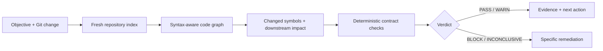

<div align="center">

# Conclave

### AI writes. Conclave verifies.

**An independent, local-first verification gate for code changes and AI completion claims.**

[](https://nodejs.org/)
[](https://www.typescriptlang.org/)
[](https://www.npmjs.com/package/conclave-ai)
[](LICENSE)
[](#trust-boundary)

[Install](#installation) · [First validation](#first-validation) · [Agent skills](#agent-skills) · [Provider setup](#optional-model-provider-setup) · [Architecture](#how-the-pieces-fit) · [Docs](#documentation)

</div>

---

Conclave is the verification layer that runs after a change is written. Give it an objective, a Git change set, and optional machine-checkable claims. It builds a fresh code graph, follows the impact beyond the diff, and returns an evidence-backed decision:

```text
PASS  ·  WARN  ·  BLOCK  ·  INCONCLUSIVE
```

It is deliberately not another agent that says “looks good.” The primary command, `conclave review`, is local, deterministic, and makes **zero model calls**.

## Why Conclave?

Small diffs often have large consequences. Renaming an exported function can leave callers unchanged. Deleting a token key can affect a lifecycle path that never appears in the diff. An AI agent can confidently claim a task is done while a deterministic fact in the repository contradicts it.

Conclave gives a reviewer, CI gate, or coding agent an independent answer to a narrower and more useful question:

> Does the repository provide evidence that this exact change achieved its stated objective?

| Conclave does | Conclave does not |
| --- | --- |
| Collects Git changes without running repository code | Trust an agent's completion message |
| Maps changed lines to symbols and graph impact | Treat a small diff as inherently safe |
| Checks explicit, deterministic claims | Turn uncertainty into a false pass |
| Returns evidence, remediation, and machine-readable JSON | Require an API key for validation |

## Ways to use Conclave

Conclave is one validation engine with several entry points. Use only the surface that fits your workflow.

| Surface | Best for | API key? |
| --- | --- | ---: |
| **CLI** | Local reviews, scripts, and exploration | No |
| **Codex / Claude Code skill** | Asking a coding agent to independently verify its work | No |
| **CI gate** | Blocking a merge from a schema-v1 verdict and exit code | No |
| **MCP server** | Giving an MCP client read-only validation and repository evidence | No |
| **Local web UI** | A human-first verdict, impact view, and evidence browser | No |
| **Ask / Investigate / Task** | Optional model-backed repository reasoning | Yes |

The **npm package is the distribution channel**, the **CLI is the executable**, and the **skill is an explicit integration installed by the CLI**. The web UI is optional; it is not required to install or run the skill.

## Installation

**Requirements:** Node.js 20+ and Git.

### Try it without installing

This is the fastest way to review the repository in your current directory:

```bash
npx --yes --package=conclave-ai conclave review . --working \
  --objective "Restore the session after page refresh"
```

### Install in a project

This is the recommended team setup: the Conclave version is recorded with the repository and can be used from package scripts or CI.

```bash
# npm
npm install --save-dev conclave-ai
npx --no-install conclave review . --working --objective "..."

# Yarn
yarn add --dev conclave-ai
yarn conclave review . --working --objective "..."

# pnpm
pnpm add --save-dev conclave-ai
pnpm exec conclave review . --working --objective "..."
```

### Install the global CLI

Choose a global install when you want `conclave` available in every terminal:

```bash
npm install --global conclave-ai

conclave review . --working \
  --objective "Restore the session after page refresh"
```

Global installation is a convenience, not a requirement. Project-local and one-off execution expose the same CLI.

### Build from source

Use the repository checkout when contributing to Conclave itself:

```bash
git clone https://github.com/carvalhobfr/conclave.git
cd conclave
npm install
npm run build

node dist/cli.js review . --working \
  --objective "Restore the session after page refresh"
```

The examples below use the global `conclave` form for readability. With a project-local installation, replace it with `npx --no-install conclave` (or the equivalent Yarn/pnpm command). From source, use `node dist/cli.js`.

## First validation

Review the tracked working-tree change against `HEAD` and state the behavior the change is supposed to achieve:

```bash
conclave review . --working \
  --objective "Restore the session after page refresh"
```

The result is designed to be read first and parsed second:

```text
Validation verdict: PASS
The change matches its objective with no deterministic contradiction.

Changed: 3 files / 7 symbols
Impact: 5 files / 12 symbols
```

Add `--json` when a CI job, skill, or another tool needs the full schema-v1 report.

```bash
conclave review . --staged \
  --objective "Reject expired access tokens" \
  --json
```

### Choose exactly what to review

```bash
# Default: tracked working-tree changes against HEAD
conclave review . --working --objective "..."

# Only the staged snapshot
conclave review . --staged --objective "..."

# A branch, commit, or checked-out merge result
conclave review . --branch origin/main --objective "..."
conclave review . --commit HEAD --objective "..."
```

Working-tree review intentionally refuses to ignore untracked files. Staged review refuses unstaged contamination. Branch and commit review require a clean tree. These constraints make the diff and the indexed snapshot describe the same repository state.

### Understand the verdict

| Verdict | Exit code | Meaning |
| --- | ---: | --- |
| `PASS` | `0` | No deterministic blocker or warning was found. |
| `WARN` | `0` | The review is usable, but a human should inspect the stated risk. |
| `BLOCK` | `1` | A deterministic contradiction, parse failure, or scope violation exists. |
| `INCONCLUSIVE` | `2` | The available evidence cannot honestly prove the objective. |

`WARN` is not a green light. `INCONCLUSIVE` is not a failure of confidence—it is the correct result when proof is missing.

## How it works



For every review, Conclave:

1. Collects a working-tree, staged, branch, or commit diff through read-only Git commands.
2. Parses the resulting TypeScript/JavaScript project and builds a syntax-aware graph.
3. Maps the diff to symbols, then expands through callers, references, imports, exports, and containment.
4. Tests the declared objective and contract claims against repository evidence.
5. Reports a verdict, findings, changed and impacted symbols, evidence locations, and remediation.

The interesting part is step three: Conclave looks beyond files you edited. If a changed exported symbol has unchanged consumers, those consumers appear in the impact report.

## How the pieces fit

| Component | Responsibility | Runs models? |
| --- | --- | ---: |
| `GitChangeSetService` | Collects a bounded working, staged, branch, or commit change | No |
| Repository index + code graph | Parses symbols and connects imports, exports, calls, references, and containment | No |
| `SuperValidator` | Compares objective, scope, claims, diff, and graph impact | No |
| CLI / skill / MCP / CI / web UI | Different interfaces over the same schema-v1 validation result | No |
| Reasoning engine | Powers optional Ask, Investigate, and Task workflows from retrieved evidence | Yes |

Node.js is Conclave's runtime, not a requirement that the repository itself be a Node application. The Git collector and file-level contract checks work at repository level. Today, however, **deep symbol and dependency graph analysis is implemented for TypeScript and JavaScript**. Other language parsers can be added behind the same indexing and validation interfaces; until then, Conclave should not claim universal graph coverage.

The public package contains the CLI, library exports, skill payload, MCP server, and local web server. Every interface converges on the same validation domain rather than maintaining a separate verdict implementation.

## Make the quality bar explicit

An objective is useful; a validation contract is stronger. Contracts convert “done” into checks that Conclave can fetch and compare.

```json
{
  "objective": "Restore authentication after refresh without changing unrelated routes",
  "allowedPathPrefixes": ["src/auth", "tests/auth"],
  "claims": [
    {
      "id": "restore-exists",
      "statement": "bootstrapSession exists in the resulting project.",
      "check": {
        "kind": "symbol-exists",
        "symbol": "bootstrapSession",
        "expectation": "present"
      }
    },
    {
      "id": "legacy-key-removed",
      "statement": "The legacy token key no longer exists.",
      "check": {
        "kind": "text",
        "text": "legacy-auth-token",
        "expectation": "absent"
      }
    }
  ]
}
```

```bash
conclave review . --branch origin/main \
  --contract examples/validation-contract.json
```

Supported deterministic checks: `symbol-exists`, `callers`, `references`, `text`, and `file-changed`. See the [public report schema](schemas/validation-report.v1.schema.json) for the machine contract.

## Trust boundary

### Deterministic by default

`conclave review` does not require a model, a provider account, or a network call. Every schema-v1 validation report records its own boundary:

```json
{
  "deterministic": true,
  "reasoningModelCalls": 0,
  "repositoryScriptsExecuted": false,
  "knowledge": {
    "parser": "typescript-compiler-6.0",
    "graph": "syntax-aware",
    "embedding": {
      "id": "conclave-local-hash-v1",
      "kind": "deterministic-feature-hash",
      "remoteCalls": 0
    }
  }
}
```

Repository content is untrusted input. Conclave invokes Git with `shell: false`, disables prompts, bounds output and time, and never executes a repository script during review. Configured remote embeddings are never used for the validation gate.

## Optional model provider setup

You do **not** need an API key, model, or provider to run `conclave review`, the agent skill's validation workflow, CI validation, or `conclave_validate` over MCP.

A provider is only needed for the optional Ask, Investigate, and Task surfaces. Those surfaces retrieve bounded repository evidence before calling a model; they never change the deterministic trust boundary of `review`.

### Guided CLI setup

Run setup from the repository that should own the local configuration:

```bash
conclave models     # inspect the maintained choices first
conclave init       # interactive provider, model, reasoning, and API-key setup
conclave config     # show the resulting non-secret configuration
conclave provider-check
```

`conclave init` presents a colored four-step setup for provider, model, reasoning, and credentials. It accepts a custom model ID, hides API-key input, writes a managed block to the project's `.env`, and restricts the file to the current user. Set [`NO_COLOR`](https://no-color.org/) when plain terminal output is preferred. Make sure `.env` is ignored by the target repository before committing; Conclave's own repository already ignores it.

| Provider | Accepted credential and billing | Included profile IDs |
| --- | --- | --- |
| `openai` | Standard OpenAI Platform API key. The same key can call available Codex API models when the project has access. Usage belongs to that API project/organization. ChatGPT/Codex OAuth or session tokens are not API keys. | `balanced`, `frontier`, `efficient`, `coding` |
| `openrouter` | OpenRouter inference API key. Requests use the credits, spending limits, and free-model allowance of that OpenRouter account. | `openai-latest`, `claude-sonnet-latest`, `claude-opus-latest`, `free` |
| `anthropic` | Standard Anthropic Console API key. Usage belongs to the Anthropic workspace attached to it. | `balanced`, `deep`, `knowledge`, `pinned` |

Select a profile or provide any model ID supported by the chosen provider:

```bash
conclave init --provider openai --profile balanced
conclave init --provider openrouter --profile claude-sonnet-latest
conclave init --provider anthropic --profile deep
conclave init --provider openrouter --model "provider/custom-model"
```

OpenRouter is a **model provider**, not an agent-skill host. Codex and Claude Code are the hosts into which Conclave installs a skill. Anthropic is the direct provider used when optional reasoning should call Claude models without going through OpenRouter.

An OpenRouter management key cannot run inference, and a subscription from another product is not automatically an OpenRouter API key. Create an inference key in [OpenRouter settings](https://openrouter.ai/settings/keys); Conclave then consumes the credits and limits associated with that account. For OpenAI, create or use a standard key from the [OpenAI API dashboard](https://platform.openai.com/api-keys).

For non-interactive setup, pass the secret through standard input instead of exposing it in a command-line argument or shell history:

```bash
printf '%s' "$CONCLAVE_SETUP_API_KEY" | conclave init \
  --provider openrouter \
  --profile claude-sonnet-latest \
  --reasoning fast \
  --api-key-stdin
```

Use `--reasoning full` for cross-module architecture review or `--reasoning fast` for the smaller investigator, verifier, and judge path. Run `conclave models --provider openrouter` whenever you want the current curated list.

## Agent skills

Conclave ships `conclave-validate` as an [Agent Skills](https://agentskills.io/) workflow, with project layouts for both [Codex](https://learn.chatgpt.com/docs/build-skills) and [Claude Code](https://code.claude.com/docs/en/slash-commands):

```text
skills/conclave-validate/          portable packaged skill
.agents/skills/conclave-validate/ Codex project skill
.claude/skills/conclave-validate/ Claude Code project skill
```

The skill does not replace the CLI. It teaches the host agent how to collect an objective, run Conclave's bounded JSON runner, reconcile the verdict with the process exit code, and report the decision without turning `BLOCK` or `INCONCLUSIVE` into approval.

### Install for one repository

Install the package in the repository, then copy the skill for Codex, Claude Code, or both:

```bash
npm install --save-dev conclave-ai

# Codex -> .agents/skills/conclave-validate
npx --no-install conclave skill install --target codex --scope project --project .

# Claude Code -> .claude/skills/conclave-validate
npx --no-install conclave skill install --target claude --scope project --project .

# Or install both adapters in one command
npx --no-install conclave skill install --target both --scope project --project .
```

Commit the generated skill directory when the validation workflow should travel with the repository. The npm install alone never changes `.agents/` or `.claude/`; skill installation is intentionally explicit.

### Install for your user

A user-scoped skill is available in every repository opened by that host:

```bash
npm install --global conclave-ai
export CONCLAVE_BIN=conclave

conclave skill install --target codex --scope user
conclave skill install --target claude --scope user
# or: conclave skill install --target both --scope user
```

This writes `~/.agents/skills/conclave-validate` for Codex and `~/.claude/skills/conclave-validate` for Claude Code. `CONCLAVE_BIN=conclave` tells a user-scoped runner to use the global executable; a project-local `conclave-ai` dependency is detected automatically.

### Invoke and maintain the skill

| Host | Direct invocation | Automatic use |
| --- | --- | --- |
| Codex | `$conclave-validate` | Ask Codex to validate a working tree, staged change, branch, or commit |
| Claude Code | `/conclave-validate` | Ask Claude to validate a change before accepting or merging it |

Preview destinations with `--dry-run`. An existing different skill is never overwritten unless you review the difference and explicitly pass `--force`. For another Agent Skills-compatible host, use the portable target:

```bash
conclave skill install --target both --scope project --project . --dry-run
conclave skill install --target portable --destination ./vendor/conclave-validate
```

### MCP integration

For MCP-capable clients, start a stdio server rooted at one repository:

```bash
conclave mcp /absolute/path/to/repository
```

Clients can call `conclave_validate` and receive the same schema-v1 report and zero-model-call trust boundary. If a provider is configured server-side, the MCP surface can also expose bounded repository reasoning; clients still cannot select arbitrary host paths or enable Task Mode.

## Local web validation

Want a human-first decision view instead of JSON? The current release starts the UI from a source checkout:

```bash
npm run build
npm run start:web
# http://127.0.0.1:4317
```

The local UI starts in **Validate**. Choose the change source, write the objective, optionally paste a contract, and get the verdict before the raw report. It highlights the largest risk, the next action, claim outcomes, changed and graph-impacted symbols, and evidence paths.

The server binds to `127.0.0.1`, opens local repositories for analysis, and runs the same deterministic collector and `SuperValidator` as the CLI. It is an optional view over Conclave, not a separate cloud service and not the agent-skill installer.

## CI gate

Use a committed validation contract when the quality bar should be versioned with the project. A pull-request workflow can compare the checked-out change against its actual base branch:

```yaml
name: Conclave

on:
  pull_request:

jobs:
  validate:
    runs-on: ubuntu-latest
    steps:
      - uses: actions/checkout@v4
        with:
          fetch-depth: 0
      - uses: actions/setup-node@v4
        with:
          node-version: 20
          cache: npm
      - run: npm ci
      - run: >-
          npx --no-install conclave review .
          --branch origin/${{ github.base_ref }}
          --contract .conclave/review-contract.json
          --json
```

Run a branch comparison before the change is merged. Comparing the already-merged `main` checkout with `origin/main` correctly produces a blocking `no-change` finding because there is no resolution diff left to validate.

## More than one command

`review` is the promise. The rest of the CLI helps you inspect the evidence that led there:

```bash
# Build a local index and inspect repository evidence
conclave index /path/to/repository
conclave retrieve /path/to/repository "Where is bootstrapSession called?"
conclave graph /path/to/repository bootstrapSession --operation callers

# Optional API-backed repository reasoning
conclave ask /path/to/repository "Why might authentication disappear after refresh?"
```

Task Mode is isolated and permission-controlled. It cannot turn an Ask or Review request into permission to edit a repository, run checks, execute package scripts, or use the network.

## What the npm package contains

The package name is `conclave-ai`; its executable is `conclave`.

| Packaged surface | Purpose |
| --- | --- |
| `dist/cli.js` | CLI entry point exposed as the `conclave` binary |
| `dist/index.js` + type declarations | Library exports for embedding Conclave in Node.js/TypeScript tooling |
| `skills/conclave-validate` | Canonical portable agent skill |
| `scripts/install-agent-skill.mjs` | Explicit project/user skill installer |
| Web and MCP modules in `dist/` | Local product and protocol interfaces |

Installing the package never modifies agent settings, starts a server, sends repository data, or requests an API key. Those actions happen only when you run the corresponding command.

## Current limits

- The deterministic parser currently targets TypeScript and JavaScript.
- The graph is syntax-aware; it does not yet use the TypeScript type checker or `tsconfig` aliases.
- Deleted-only changes return `INCONCLUSIVE` because the validator indexes the current result, not both base and head snapshots.
- Review does not run repository tests. Test execution remains a separately permissioned capability.
- Free-form semantic claims require the bounded reasoning layer; the deterministic gate accepts structured claims.
- Precision and false-positive rates still need continued dogfooding on external pull requests.

## Documentation

| Topic | Read |
| --- | --- |
| Installation and first review | [Installation](#installation) and [First validation](#first-validation) |
| Codex and Claude Code skills | [Agent skills](#agent-skills) and [`conclave-validate`](skills/conclave-validate/SKILL.md) |
| Provider and model setup | [Optional model provider setup](#optional-model-provider-setup) |
| Super-validator design | [docs/super-validator.md](docs/super-validator.md) |
| Security boundaries | [docs/security.md](docs/security.md) |
| Validation report contract | [schemas/validation-report.v1.schema.json](schemas/validation-report.v1.schema.json) |
| Reasoning architecture | [docs/phase-3-reasoning.md](docs/phase-3-reasoning.md) |
| Task execution policy | [docs/phase-4-task-execution.md](docs/phase-4-task-execution.md) |
| Product UI | [docs/phase-5-product-ui.md](docs/phase-5-product-ui.md) |
| Release readiness | [docs/phase-6-release-readiness.md](docs/phase-6-release-readiness.md) |

## Inspiration

[Gauntlet Loop](https://github.com/robonuggets/gauntlet-loop) is a prompt skill, not a reusable validation engine. Conclave carries forward the useful ideas—an explicit quality bar, independent criticism, and inspection of real output—while replacing an open-ended loop with bounded, evidence-backed decisions.

## Contributing

Contributions are welcome. Start with [CONTRIBUTING.md](CONTRIBUTING.md), then run the complete local gate:

```bash
npm run verify
```

Conclave is released under the [MIT License](LICENSE).
