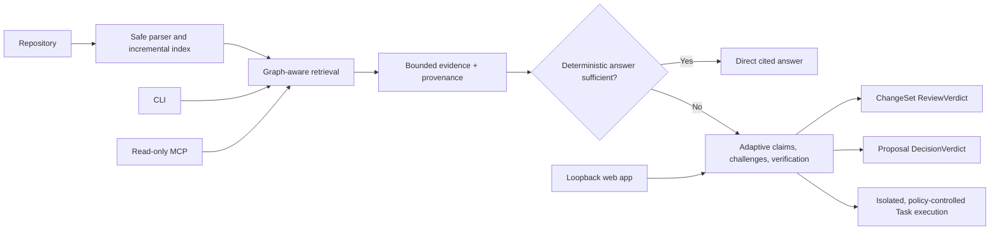

# Conclave

**AI writes. Conclave verifies.**

Conclave builds structural knowledge of your codebase and validates AI plans and code changes against repository evidence before you trust them. It invokes models only when reasoning is necessary.

*Ask your code. Let the models argue.*

It is an evidence-driven validation layer for AI-assisted software development—not another agent that must write the code itself.

## Highlights

- **Understand — Ask and Investigate**: cited answers, tested hypotheses, and visible uncertainty.
- **Validate — Review and Decide**: challenge plans and inspect working-tree, staged, branch, commit, or pasted changes in repository context.
- **Act — Task**: optional plan-first, isolated patches with default-deny edits and checks.
- **Code graph** — deterministic symbols, imports, calls, references, callers/callees, and bounded paths.
- **Project Knowledge** — index once, query many times, and reuse unchanged structural state.
- **Adaptive analysis** — use the smallest useful workflow: multiple models, one model, or zero model calls.
- **Graph-aware retrieval** — BM25, deterministic feature vectors, fusion, graph expansion, context budgets, and inspectable plans.
- **Local-first product** — loopback web workspace, CLI, and a compact read-only MCP server.
- **Provider boundaries** — OpenAI-compatible API and Local endpoints; credentials remain server/process-side.
- **Deterministic demo** — full Ask, Investigate, rejected hypothesis, revision, diff, and verdict flow without an API key.

## Daily workflows

### Validate an AI decision

```text
Coding agent proposes a fix
  → Conclave Decide challenges its assumptions
  → repository evidence validates the claims
  → implementation or revision handoff
```

### Review AI-generated changes

Open **Review**, then select **Staged changes**, **Working tree**, **Branch comparison**, **Commit comparison**, or paste a unified diff. Conclave reports what changed, what it affects, what is confirmed, and what remains uncertain.

### Understand unfamiliar code

Use **Ask** for a concise cited answer or **Investigate** for causal, cross-module questions. Task remains available when you explicitly want Conclave to plan or produce an isolated change.

## Bring your models

**Use the models you already have.** Roles are independent from models, and presets are the normal path—per-role routing is optional.

- **Local — Ollama, LM Studio, or a compatible loopback endpoint.** Repository reasoning can remain on your machine when both inference and embeddings use local loopback endpoints.
- **Currently free compatible providers — OpenCode Zen or OpenRouter.** Use currently available free models without treating today's catalog as permanent. Availability, limits, and data handling are provider-controlled. OpenRouter requires your own OpenRouter API key, including when you select a currently free model.
- **BYOK — OpenAI or another OpenAI-compatible HTTPS provider.** Bring your own provider, model, endpoint, and API key.
- **Mix & Match.** Model A can investigate, Model B can challenge, and another configured model can implement or independently review. Model agreement is not proof; repository evidence and deterministic verification decide.
- **No model required.** Sometimes the best model is no model. When Project Knowledge already proves an answer or Review result, Conclave can finish with **0 model calls**—reducing latency, cost, and unnecessary source transmission.

## Architecture



Repository source is always treated as untrusted data. Models do not receive filesystem, shell, Git, provider-configuration, or arbitrary patch authority.

## Quick start

Requires Node.js 20 or newer.

```bash
git clone <repository-url>
cd conclave
npm install
npm run demo
```

`npm run demo` runs the deterministic end-to-end fixture using fake model responses. It does not need an API key and leaves the bundled demo repository unchanged. The direct Ask path visibly resolves through Project Knowledge with **Model calls: 0**; fake providers cover the paths where model reasoning is required.

For the full release gate:

```bash
npm run verify
```

This runs deterministic tests, web tests, typecheck, lint, builds, retrieval/reasoning/task evaluations, and a dependency audit.

## Use the local web workspace

```bash
npm run build
npm run start:web
```

Open `http://127.0.0.1:4317`. The server listens only on loopback. Demo Mode works without credentials; opening another folder requires it to be inside `CONCLAVE_WEB_ALLOWED_ROOT` (or the process working directory by default).

Analysis depth defaults to Auto. Fast prioritizes deterministic evidence and minimal calls; Balanced permits additional conditional reasoning; Deep trades latency and context for more adversarial validation. The Review workspace accepts Git ChangeSets or an explicit unified diff. Decide validates proposal claims before implementation. Active Ask, Investigate, and Task runs show evidence-backed progress and can be cancelled without applying Task work to the original repository.

## Use the CLI

```bash
npm run dev -- index /path/to/repository
npm run dev -- retrieve /path/to/repository "Where is bootstrapSession called?"
npm run dev -- graph /path/to/repository bootstrapSession --operation callers
npm run dev -- path /path/to/repository AuthProvider getStoredToken --depth 4
npm run dev -- ask /path/to/repository "Why might authentication disappear after refresh?"
npm run dev -- task /path/to/repository "Fix the missing session restore" --plan-only
```

Task execution is never implied by Ask or Investigate. To permit an isolated edit, use explicit Task permissions; repository scripts and network access remain disabled unless separately granted.

## Use Conclave through MCP

```bash
npm run dev -- mcp /path/to/repository
```

The stdio MCP server is read-only. It exposes compact search, symbol, graph, graph-path, evidence, Ask, and Investigate tools. External clients cannot select another repository root, access environment variables, configure providers, run commands, or enter Task Mode. MCP responses label repository content as untrusted evidence.

## Provider details and privacy

Conclave uses the OpenAI-compatible Chat Completions API where base URL, model, and credentials are sufficient. This supports OpenAI, OpenRouter, OpenCode Zen, Ollama, LM Studio, and compatible services when configured. Native Anthropic and Gemini protocols are not implemented.

```bash
npm run dev -- config --json
npm run dev -- provider-check
```

- **Free configuration** defaults to OpenCode Zen at `https://opencode.ai/zen/v1`, uses the existing server-owned credential boundary, and restricts roles to a host allowlist. This repository does not publish a hosted Conclave Free service. Selected excerpts may leave the machine.
- **API/BYOK Mode** uses your provider API key and requires HTTPS. OpenRouter works through the existing OpenAI-compatible adapter and requires an OpenRouter key; current free-model availability is controlled by OpenRouter.
- **Local Mode** accepts loopback HTTP(S) endpoints for Ollama, LM Studio, or compatible services. Local inference alone is not an unconditional privacy guarantee: embeddings must also be local to keep both flows on the machine.

The checked-in Free configuration currently assigns different provider-controlled model IDs by role; those models and their availability can change. Role overrides inherit the active mode endpoint and credential without copying the credential into role configuration. An active personal provider set in Settings overrides `.env`, uses the user's own key, and cannot reuse the locked server-owned Free credential.

`provider-check` performs one bounded inference and reports the effective endpoint host, exact default model, and role-to-provider/model assignments without returning a credential. Provider model availability remains controlled by OpenCode Zen and may change.

The default `conclave-local-hash-v1` embedding is deterministic feature hashing for offline use and CI. Learned OpenAI-compatible embeddings are opt-in and require an explicit model, endpoint, and dimension configuration. Conclave never silently switches embedding strategies.

See [.env.example](.env.example) for Free, OpenRouter, OpenAI-compatible BYOK, local inference, embeddings, and optional role overrides. The CLI and local web entry point load a root `.env` as a fallback; variables already owned by the process take priority. Runtime credentials are held process/server-side, are not stored in the repository index, and are not inherited by repository commands. Personal keys entered in Settings are sent to the local server, stored separately in an owner-only settings file, and never returned in settings responses; see [Security boundaries](docs/security.md).

For a credential-aware live check, run `npm run test:zen`. It exits safely when no Free credential is configured; set `CONCLAVE_ZEN_FULL_SMOKE=1` to additionally run one real repository reasoning flow. See [Phase 7 Free Mode](docs/phase-7-zen-free.md).

## Safety model

Task Mode preserves this invariant:

```text
model requests a typed capability
        ↓
Conclave policy validates permissions, scope, hashes, and budgets
        ↓
structured runner executes an approved fixed command, when permitted
```

There is no raw model-to-shell path. Patches use exact expected hashes, execute only in an isolated worktree or filtered copy, and are verified after reindexing. The original repository is never modified automatically.

Read [the security boundaries](docs/security.md) before enabling repository scripts on untrusted code.

## Evaluation

Committed deterministic fixtures provide regression evidence for retrieval, graph-aware retrieval, reasoning, and Task orchestration:

```bash
npm run eval
npm run eval:graph
npm run eval:release
npm run eval:reasoning
npm run eval:adaptive
npm run eval:review
npm run eval:decision
npm run eval:task
```

The Review benchmark explicitly measures false positives on known-good changes, missed blockers on known regressions, deterministic approvals, adaptive cases, and generic-slogan findings. Decision evaluation checks verdicts, claim resolution, adaptive routing, and both handoff directions. These fixtures are regression benchmarks, not claims of broad real-world or model accuracy. Full validation semantics are in [Phase 9 validation](docs/phase-9-validation.md).

## Limitations

- TypeScript parsing is syntax-aware but does not use a `Program`, type-checker, or `tsconfig` aliases.
- Graph edges cover deterministic static relationships; dynamic dispatch and framework wiring can remain unresolved.
- Unchanged repositories reuse the graph. A detected content change currently recomputes graph edges deterministically to preserve cross-file resolution.
- Remote Git import and a public hosted service are intentionally not included. Phase 7 adds only the provider-neutral hosted foundation: model allowlisting, usage gating, quota windows, and concurrency limits at the application boundary.
- Task patches replace existing regular-file content; they do not automatically apply, commit, push, create, rename, or delete source files.
- Repository scripts are not a portable filesystem/network sandbox and should be used only for trusted repositories.
- MCP Task Mode is intentionally unavailable in v1.

## Documentation

- [Architecture: repository and provider boundaries](docs/phase-1-architecture.md)
- [Code intelligence and retrieval](docs/phase-2-code-rag.md)
- [Graph-aware retrieval](docs/phase-2.5-graph-aware-retrieval.md)
- [Reasoning engine](docs/phase-3-reasoning.md)
- [Task execution](docs/phase-4-task-execution.md)
- [Web product](docs/phase-5-product-ui.md)
- [Release readiness and MCP](docs/phase-6-release-readiness.md)
- [OpenCode Zen Free Mode and hosted foundation](docs/phase-7-zen-free.md)
- [Knowledge-first adaptive orchestration](docs/phase-8-adaptive-orchestration.md)
- [Validation-first Review and Decision](docs/phase-9-validation.md)
- [Security boundaries](docs/security.md)

## Contributing and license

See [CONTRIBUTING.md](CONTRIBUTING.md). Conclave is released under the [MIT License](LICENSE).
