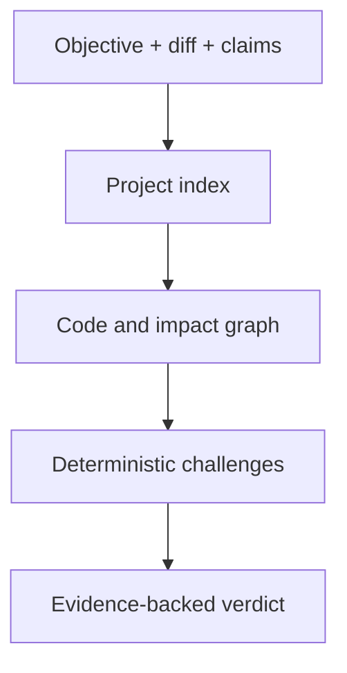

# Conclave

**AI writes. Conclave verifies.**

Conclave is a local-first, graph-aware validator for code changes. It does not need to be the agent that wrote the patch. It independently checks whether the resolution matches its objective, whether completion claims are true, and whether a small diff has consequences elsewhere in the project.

The primary product surface is `conclave review`. Ask, retrieval, graph inspection, MCP, and bounded Task execution remain available as supporting capabilities, but they are not the product promise.

## What a review does

1. Collects a working-tree, staged, branch, or commit change without executing repository code.
2. Builds the current project index and deterministic code graph.
3. Maps changed lines to symbols.
4. Expands impact through callers, references, imports, exports, containment, and contracts.
5. Checks an explicit validation contract and rejects contradicted completion claims.
6. Returns `PASS`, `WARN`, `BLOCK`, or `INCONCLUSIVE` with evidence and remediation.

A small diff is not assumed safe. If it changes an exported symbol whose callers live outside the diff, Conclave reports those unchanged consumers.

## Quick start

Requires Node.js 20 or newer.

```bash
npm install
npm run build

node dist/cli.js review . --working \
  --objective "Restore the session after page refresh"

node dist/cli.js review . --staged \
  --objective "Reject expired access tokens"

node dist/cli.js review . --branch origin/master \
  --contract examples/validation-contract.json

node dist/cli.js review . --commit HEAD \
  --objective "Rename persistToken without leaving stale callers" \
  --json
```

Review defaults to `--working` when no change source is supplied. Working review compares all tracked changes against `HEAD`. Untracked files must be staged or ignored; staged review rejects unstaged contamination, and branch/commit review requires a clean working tree so the graph and diff describe the same snapshot.

Exit codes:

| Verdict | Exit code | Meaning |
| --- | ---: | --- |
| `PASS` | 0 | Deterministic checks found no blocking or warning condition |
| `WARN` | 0 | Review is usable, but human attention is required |
| `BLOCK` | 1 | A deterministic contradiction, parser error, or scope violation exists |
| `INCONCLUSIVE` | 2 | Conclave cannot honestly prove the resolution with available evidence |

## Guided API setup and model profiles

Validation is usable with no model and no key. `conclave review` always rebuilds a deterministic local index and never calls a model. API configuration only enables the optional **Ask**, **Investigate**, and bounded **Task** flows.

Run the guided initializer from the project whose local configuration should be used:

```bash
node dist/cli.js init
node dist/cli.js models
```

The initializer asks for OpenAI, OpenRouter, or Anthropic/Claude; a provider model profile; full or fast reasoning; and an API key with terminal echo disabled. It writes a managed block to the Git-ignored `.env` without replacing unrelated variables. The key is never included in command-line arguments, JSON output, configuration diagnostics, or the validation report.

For automation, keep the secret out of shell history and pass it only on standard input:

```bash
printf '%s' "$CONCLAVE_SETUP_API_KEY" | node dist/cli.js init \
  --provider openrouter --profile claude-sonnet-latest --reasoning fast --api-key-stdin
```

`conclave models` currently includes four curated profiles for each provider. OpenAI profiles follow its current Sol/Terra/Luna capability tiers; OpenRouter profiles use documented model-family aliases (plus its free router); and Anthropic profiles use direct Messages API model IDs. Account access and routed availability remain provider-controlled, so run `conclave provider-check` after setup.

## Web validation

```bash
npm run build
npm run start:web
# open http://127.0.0.1:4317
```

The home screen starts in **Validate**. Select a working tree, staged change, base branch, or checked-out commit; describe the objective; and optionally paste a validation contract. The first result is a product decision—not raw JSON—with:

- a plain-language `PASS`, `WARN`, `BLOCK`, or `INCONCLUSIVE` headline;
- the largest remaining risk and recommended next action;
- blocking and warning counts;
- proved or contradicted completion claims;
- changed and graph-impacted files and symbols;
- evidence paths and lines;
- the exact machine-readable report under **Raw report**.

The browser calls the local server. The server runs the same deterministic Git collector and `SuperValidator` used by the CLI; no model call is required for validation.

Every schema-v1 validation report also includes a `trustBoundary`: validation rebuilds its knowledge with the TypeScript syntax parser, a syntax-aware graph, and local deterministic feature-hash embeddings. It records `reasoningModelCalls: 0`, `remoteCalls: 0`, and `repositoryScriptsExecuted: false`; configured remote embeddings are never used for the validation gate.

## Codex, Claude Code, and other agents

Conclave ships one portable `conclave-validate` skill and byte-identical project adapters for Codex and Claude Code:

```text
skills/conclave-validate/          portable source
.agents/skills/conclave-validate/ Codex project skill
.claude/skills/conclave-validate/ Claude Code project skill
```

Install the skill into another project or user profile from a Conclave checkout:

```bash
node scripts/install-agent-skill.mjs --target both --scope project --project /path/to/project
node scripts/install-agent-skill.mjs --target codex --scope user
node scripts/install-agent-skill.mjs --target portable --destination /path/used/by/another-agent
```

The same installer is available through the CLI after build:

```bash
node dist/cli.js skill install --target codex --scope project --project /path/to/project
```

The portable skill needs no API key to validate a change. When an agent needs optional API-backed reasoning, it should direct the user to `conclave init`; it must not request, print, or store the key itself.

## npm and Yarn distribution

The repository is package-ready: the CLI, portable skill, installer, README, and license are explicit package assets. It intentionally remains `private` until a package name and publishing owner are chosen, so this branch does not publish anything accidentally. After publishing a scoped package, the normal installation path is `npm install -D <package>` (or `yarn add -D <package>`), then `npx conclave skill install ...`. npm/yarn install the executable; the explicit CLI command installs the skill into the user or project agent directory, avoiding a package install silently changing agent configuration.

The skill invokes `conclave review --json` through a bounded runner, verifies that verdict and process exit code agree, and refuses to reinterpret `BLOCK` or `INCONCLUSIVE` as approval. Set `CONCLAVE_CLI_PATH` when the compiled CLI is outside the repository being reviewed.

Agents with MCP support can call `conclave_validate`. The MCP server fixes the repository root when it starts, rebuilds the current index for validation, executes only read-only Git collection and deterministic checks, and returns the same schema-v1 report with an explicit zero-model-call trust boundary.

The public machine contract is [`schemas/validation-report.v1.schema.json`](schemas/validation-report.v1.schema.json).

## Validation contracts

A contract turns the task description and the agent's completion claims into fetchable, comparable checks.

```json
{
  "objective": "Restore authentication after refresh without changing unrelated routes",
  "allowedPathPrefixes": ["src/auth", "tests/auth"],
  "claims": [
    {
      "id": "restore-exists",
      "statement": "bootstrapSession exists in the resulting project.",
      "check": {
        "kind": "symbol-exists",
        "symbol": "bootstrapSession",
        "expectation": "present"
      }
    },
    {
      "id": "legacy-removed",
      "statement": "The legacy token key no longer exists.",
      "check": {
        "kind": "text",
        "text": "legacy-auth-token",
        "expectation": "absent"
      }
    }
  ]
}
```

Supported deterministic claim checks are `symbol-exists`, `callers`, `references`, `text`, and `file-changed`. A `text` check searches indexed TypeScript/JavaScript source; use `file-changed` for documentation and configuration files.

## Architecture



Repository source is untrusted data. The review collector invokes Git with `shell: false`, disables prompts, bounds output and time, and never executes repository scripts. The first validation gate is fully deterministic and makes no model call.

## What came from the Gauntlet Loop idea

[Gauntlet Loop](https://github.com/robonuggets/gauntlet-loop) is a prompt skill, not a reusable validation engine. Conclave adopts its strongest principles without copying its implementation:

- use a concrete, fetchable quality bar;
- separate the builder from a harsh critic;
- inspect actual output instead of trusting a description;
- identify the largest remaining gap.

In Conclave, the quality bar becomes a validation contract plus repository invariants. The critic becomes an independent verifier. Unlike Gauntlet Loop, Conclave never loops indefinitely: work is bounded, and unresolved proof returns `INCONCLUSIVE`.

## Current deterministic findings

- no collected change;
- changed files outside explicit scope;
- parser diagnostics in changed source;
- graph impact outside the diff;
- exported symbol changes without changed tests;
- deleted-only behavior that requires a base index;
- contradicted or unprovable completion claims.

## Supporting tools

```bash
npm run dev -- index /path/to/repository
npm run dev -- retrieve /path/to/repository "Where is bootstrapSession called?"
npm run dev -- graph /path/to/repository bootstrapSession --operation callers
npm run dev -- ask /path/to/repository "Why might authentication disappear after refresh?"
npm run dev -- mcp /path/to/repository
```

Task Mode remains isolated and policy-controlled. It is not part of the validation trust boundary and cannot turn an Ask or Review request into permission to modify the repository.

## Validation

```bash
npm run eval:validation
npm run verify
```

The validation tests cover Git diff parsing, graph impact outside the diff, contradicted claims, and scope expansion. Existing retrieval, reasoning, Task, web, security, and release evaluations remain active.

## Current limits

- The deterministic parser currently targets TypeScript and JavaScript.
- The graph is syntax-aware and does not yet use the TypeScript type checker or `tsconfig` aliases.
- Deleted-only changes return `INCONCLUSIVE` because this branch indexes current HEAD, not both base and head.
- Review does not execute repository tests. Test execution remains a separately permissioned capability.
- Free-form semantic claims still require the bounded reasoning layer; the first review gate accepts structured deterministic claims.
- Real-world precision and false-positive rates still need dogfooding on external PRs.

See [the super-validator design](docs/super-validator.md), [security boundaries](docs/security.md), and [contributing guide](CONTRIBUTING.md).

Conclave is released under the [MIT License](LICENSE).
