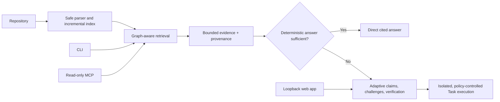

# Conclave

**Ask your code. Let the models argue.**

Conclave builds a structural model of your codebase first. It uses deterministic graph and retrieval tools to answer what it can, then selectively invokes specialized models only when reasoning is actually needed. Evidence-backed Task changes remain bounded and isolated.

It is designed for developers and coding agents that need more than a broad source dump: every answer is grounded in repository evidence, and every Task capability remains policy-controlled.

## Highlights

- **Ask** — evidence-backed answers with exact source ranges.
- **Investigate** — structured Claims, Challenges, Verification, and uncertainty instead of hidden disagreement.
- **Task** — explicit, plan-first, isolated patches with default-deny edits and checks.
- **Code graph** — deterministic symbols, imports, calls, references, callers/callees, and bounded paths.
- **Project Knowledge** — index once, query many times, and reuse unchanged structural state.
- **Adaptive analysis** — Auto, Fast, Balanced, and Deep routes with conditional roles and early exit.
- **Graph-aware retrieval** — BM25, deterministic feature vectors, fusion, graph expansion, context budgets, and inspectable plans.
- **Local-first product** — loopback web workspace, CLI, and a compact read-only MCP server.
- **Provider boundaries** — OpenAI-compatible API and Local endpoints; credentials remain server/process-side.
- **Deterministic demo** — full Ask, Investigate, rejected hypothesis, revision, diff, and verdict flow without an API key.

## Architecture



Repository source is always treated as untrusted data. Models do not receive filesystem, shell, Git, provider-configuration, or arbitrary patch authority.

## Quick start

Requires Node.js 20 or newer.

```bash
git clone <repository-url>
cd conclave
npm install
npm run demo
```

`npm run demo` runs the deterministic end-to-end fixture using fake model responses. It does not need an API key and leaves the bundled demo repository unchanged.

For the full release gate:

```bash
npm run verify
```

This runs deterministic tests, web tests, typecheck, lint, builds, retrieval/reasoning/task evaluations, and a dependency audit.

## Use the local web workspace

```bash
npm run build
npm run start:web
```

Open `http://127.0.0.1:4317`. The server listens only on loopback. Demo Mode works without credentials; opening another folder requires it to be inside `CONCLAVE_WEB_ALLOWED_ROOT` (or the process working directory by default).

Analysis depth defaults to Auto. Fast prioritizes deterministic evidence and minimal calls; Balanced permits additional conditional reasoning; Deep trades latency and context for more adversarial review. Active runs show evidence-backed progress and can be cancelled without applying Task work to the original repository.

## Use the CLI

```bash
npm run dev -- index /path/to/repository
npm run dev -- retrieve /path/to/repository "Where is bootstrapSession called?"
npm run dev -- graph /path/to/repository bootstrapSession --operation callers
npm run dev -- path /path/to/repository AuthProvider getStoredToken --depth 4
npm run dev -- ask /path/to/repository "Why might authentication disappear after refresh?"
npm run dev -- task /path/to/repository "Fix the missing session restore" --plan-only
```

Task execution is never implied by Ask or Investigate. To permit an isolated edit, use explicit Task permissions; repository scripts and network access remain disabled unless separately granted.

## Use Conclave through MCP

```bash
npm run dev -- mcp /path/to/repository
```

The stdio MCP server is read-only. It exposes compact search, symbol, graph, graph-path, evidence, Ask, and Investigate tools. External clients cannot select another repository root, access environment variables, configure providers, run commands, or enter Task Mode. MCP responses label repository content as untrusted evidence.

## Providers and privacy

Conclave uses the OpenAI-compatible Chat Completions API where base URL, model, and credentials are sufficient. This supports OpenAI, OpenRouter, OpenCode Zen, Ollama, LM Studio, and compatible services when configured. Native Anthropic and Gemini protocols are not implemented.

```bash
npm run dev -- config --json
npm run dev -- provider-check
```

- **Free Mode** defaults to OpenCode Zen at `https://opencode.ai/zen/v1`, uses a server-owned credential, and restricts every role to the host allowlist. It is external inference: selected repository excerpts may leave the machine.
- **API Mode** uses process-provided credentials and requires HTTPS.
- **Local Mode** accepts loopback HTTP(S) endpoints only. Repository retrieval is local; fully local operation also requires local inference and embedding endpoints.

The default Free ensemble assigns DeepSeek V4 Flash Free to investigation and verification, Nemotron 3 Ultra Free to skepticism, architecture, judgment, and planning, and North Mini Code Free to implementation. Role overrides inherit the active mode endpoint and credential; the credential is never copied into role configuration. An active personal provider set in Settings overrides `.env`, can use the user's own key, and cannot reuse the locked server-owned Free credential.

`provider-check` performs one bounded inference and reports the effective endpoint host, exact default model, and role-to-provider/model assignments without returning a credential. Provider model availability remains controlled by OpenCode Zen and may change.

The default `conclave-local-hash-v1` embedding is deterministic feature hashing for offline use and CI. Learned OpenAI-compatible embeddings are opt-in and require an explicit model, endpoint, and dimension configuration. Conclave never silently switches embedding strategies.

See [.env.example](.env.example) for configuration fields. The CLI and local web entry point load a root `.env` as a fallback; variables already owned by the process take priority. Credentials are not stored in the index or exposed to the browser.

For a credential-aware live check, run `npm run test:zen`. It exits safely when no Free credential is configured; set `CONCLAVE_ZEN_FULL_SMOKE=1` to additionally run one real repository reasoning flow. See [Phase 7 Free Mode](docs/phase-7-zen-free.md).

## Safety model

Task Mode preserves this invariant:

```text
model requests a typed capability
        ↓
Conclave policy validates permissions, scope, hashes, and budgets
        ↓
structured runner executes an approved fixed command, when permitted
```

There is no raw model-to-shell path. Patches use exact expected hashes, execute only in an isolated worktree or filtered copy, and are verified after reindexing. The original repository is never modified automatically.

Read [the security boundaries](docs/security.md) before enabling repository scripts on untrusted code.

## Evaluation

Committed deterministic fixtures provide regression evidence for retrieval, graph-aware retrieval, reasoning, and Task orchestration:

```bash
npm run eval
npm run eval:graph
npm run eval:release
npm run eval:reasoning
npm run eval:adaptive
npm run eval:task
```

The release corpus contains 12 retrieval cases across authentication, storage, lifecycle, subscriptions, graph paths, types, and ambiguous symbols. These are deterministic regression benchmarks, not claims of broad real-world or model accuracy. Full methodology and current limitations are in [Phase 6 release readiness](docs/phase-6-release-readiness.md).

## Limitations

- TypeScript parsing is syntax-aware but does not use a `Program`, type-checker, or `tsconfig` aliases.
- Graph edges cover deterministic static relationships; dynamic dispatch and framework wiring can remain unresolved.
- Unchanged repositories reuse the graph. A detected content change currently recomputes graph edges deterministically to preserve cross-file resolution.
- Remote Git import and a public hosted service are intentionally not included. Phase 7 adds only the provider-neutral hosted foundation: model allowlisting, usage gating, quota windows, and concurrency limits at the application boundary.
- Task patches replace existing regular-file content; they do not automatically apply, commit, push, create, rename, or delete source files.
- Repository scripts are not a portable filesystem/network sandbox and should be used only for trusted repositories.
- MCP Task Mode is intentionally unavailable in v1.

## Documentation

- [Architecture: repository and provider boundaries](docs/phase-1-architecture.md)
- [Code intelligence and retrieval](docs/phase-2-code-rag.md)
- [Graph-aware retrieval](docs/phase-2.5-graph-aware-retrieval.md)
- [Reasoning engine](docs/phase-3-reasoning.md)
- [Task execution](docs/phase-4-task-execution.md)
- [Web product](docs/phase-5-product-ui.md)
- [Release readiness and MCP](docs/phase-6-release-readiness.md)
- [OpenCode Zen Free Mode and hosted foundation](docs/phase-7-zen-free.md)
- [Knowledge-first adaptive orchestration](docs/phase-8-adaptive-orchestration.md)
- [Security boundaries](docs/security.md)

## Contributing and license

See [CONTRIBUTING.md](CONTRIBUTING.md). Conclave is released under the [MIT License](LICENSE).
