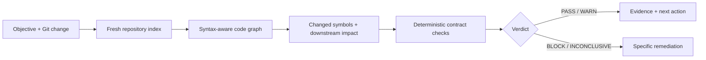

<div align="center">

# Conclave

### AI writes. Conclave verifies.

**An independent, local-first verification gate for code changes and AI completion claims.**

[](https://nodejs.org/)
[](https://www.typescriptlang.org/)
[](LICENSE)
[](#trust-boundary)

[Quick start](#quick-start) · [How it works](#how-it-works) · [Agent integrations](#agents-and-skills) · [Documentation](#documentation) · [Contributing](CONTRIBUTING.md)

</div>

---

Conclave is the verification layer that runs after a change is written. Give it an objective, a Git change set, and optional machine-checkable claims. It builds a fresh code graph, follows the impact beyond the diff, and returns an evidence-backed decision:

```text
PASS  ·  WARN  ·  BLOCK  ·  INCONCLUSIVE
```

It is deliberately not another agent that says “looks good.” The primary command, `conclave review`, is local, deterministic, and makes **zero model calls**.

## Why Conclave?

Small diffs often have large consequences. Renaming an exported function can leave callers unchanged. Deleting a token key can affect a lifecycle path that never appears in the diff. An AI agent can confidently claim a task is done while a deterministic fact in the repository contradicts it.

Conclave gives a reviewer, CI gate, or coding agent an independent answer to a narrower and more useful question:

> Does the repository provide evidence that this exact change achieved its stated objective?

| Conclave does | Conclave does not |
| --- | --- |
| Collects Git changes without running repository code | Trust an agent's completion message |
| Maps changed lines to symbols and graph impact | Treat a small diff as inherently safe |
| Checks explicit, deterministic claims | Turn uncertainty into a false pass |
| Returns evidence, remediation, and machine-readable JSON | Require an API key for validation |

## Quick start

**Requirements:** Node.js 20+ and Git.

```bash
git clone https://github.com/carvalhobfr/conclave.git
cd conclave
npm install
npm run build

node dist/cli.js review . --working \
  --objective "Restore the session after page refresh"
```

The result is designed to be read first and parsed second:

```text
Validation verdict: PASS
The change matches its objective with no deterministic contradiction.

Changed: 3 files / 7 symbols
Impact: 5 files / 12 symbols
```

Add `--json` when a CI job, skill, or another tool needs the full schema-v1 report.

```bash
node dist/cli.js review . --staged \
  --objective "Reject expired access tokens" \
  --json
```

### Choose exactly what to review

```bash
# Default: tracked working-tree changes against HEAD
node dist/cli.js review . --working --objective "..."

# Only the staged snapshot
node dist/cli.js review . --staged --objective "..."

# A branch, commit, or checked-out merge result
node dist/cli.js review . --branch origin/main --objective "..."
node dist/cli.js review . --commit HEAD --objective "..."
```

Working-tree review intentionally refuses to ignore untracked files. Staged review refuses unstaged contamination. Branch and commit review require a clean tree. These constraints make the diff and the indexed snapshot describe the same repository state.

### Understand the verdict

| Verdict | Exit code | Meaning |
| --- | ---: | --- |
| `PASS` | `0` | No deterministic blocker or warning was found. |
| `WARN` | `0` | The review is usable, but a human should inspect the stated risk. |
| `BLOCK` | `1` | A deterministic contradiction, parse failure, or scope violation exists. |
| `INCONCLUSIVE` | `2` | The available evidence cannot honestly prove the objective. |

`WARN` is not a green light. `INCONCLUSIVE` is not a failure of confidence—it is the correct result when proof is missing.

## How it works



For every review, Conclave:

1. Collects a working-tree, staged, branch, or commit diff through read-only Git commands.
2. Parses the resulting TypeScript/JavaScript project and builds a syntax-aware graph.
3. Maps the diff to symbols, then expands through callers, references, imports, exports, and containment.
4. Tests the declared objective and contract claims against repository evidence.
5. Reports a verdict, findings, changed and impacted symbols, evidence locations, and remediation.

The interesting part is step three: Conclave looks beyond files you edited. If a changed exported symbol has unchanged consumers, those consumers appear in the impact report.

## Make the quality bar explicit

An objective is useful; a validation contract is stronger. Contracts convert “done” into checks that Conclave can fetch and compare.

```json
{
  "objective": "Restore authentication after refresh without changing unrelated routes",
  "allowedPathPrefixes": ["src/auth", "tests/auth"],
  "claims": [
    {
      "id": "restore-exists",
      "statement": "bootstrapSession exists in the resulting project.",
      "check": {
        "kind": "symbol-exists",
        "symbol": "bootstrapSession",
        "expectation": "present"
      }
    },
    {
      "id": "legacy-key-removed",
      "statement": "The legacy token key no longer exists.",
      "check": {
        "kind": "text",
        "text": "legacy-auth-token",
        "expectation": "absent"
      }
    }
  ]
}
```

```bash
node dist/cli.js review . --branch origin/main \
  --contract examples/validation-contract.json
```

Supported deterministic checks: `symbol-exists`, `callers`, `references`, `text`, and `file-changed`. See the [public report schema](schemas/validation-report.v1.schema.json) for the machine contract.

## Trust boundary

### Deterministic by default

`conclave review` does not require a model, a provider account, or a network call. Every schema-v1 validation report records its own boundary:

```json
{
  "deterministic": true,
  "reasoningModelCalls": 0,
  "repositoryScriptsExecuted": false,
  "knowledge": {
    "parser": "typescript-compiler-6.0",
    "graph": "syntax-aware",
    "embedding": {
      "id": "conclave-local-hash-v1",
      "kind": "deterministic-feature-hash",
      "remoteCalls": 0
    }
  }
}
```

Repository content is untrusted input. Conclave invokes Git with `shell: false`, disables prompts, bounds output and time, and never executes a repository script during review. Configured remote embeddings are never used for the validation gate.

### Optional reasoning is separate

Ask, Investigate, and bounded Task Mode are optional product surfaces. They can use a provider, but they do not change the trust boundary of `review`.

Run guided setup from the repository that should own the local configuration:

```bash
node dist/cli.js init
node dist/cli.js models
```

The setup flow asks for OpenAI, OpenRouter, or Anthropic/Claude; offers four curated profiles for each; allows a custom model; and chooses full or fast reasoning. API-key input is hidden, and the generated managed block lives in Git-ignored `.env` with owner-only file permissions.

For automation, pass the secret through standard input rather than a command-line argument:

```bash
printf '%s' "$CONCLAVE_SETUP_API_KEY" | node dist/cli.js init \
  --provider openrouter \
  --profile claude-sonnet-latest \
  --reasoning fast \
  --api-key-stdin
```

Then run a bounded connectivity check:

```bash
node dist/cli.js provider-check
```

## Agents and skills

Conclave ships one portable `conclave-validate` skill and byte-identical adapters for Codex and Claude Code:

```text
skills/conclave-validate/          portable source
.agents/skills/conclave-validate/ Codex project skill
.claude/skills/conclave-validate/ Claude Code project skill
```

Install a skill into another project:

```bash
node dist/cli.js skill install \
  --target codex \
  --scope project \
  --project /path/to/repository
```

The skill calls `conclave review --json` through a bounded runner, verifies that the process exit code agrees with the report verdict, and refuses to reinterpret `BLOCK` or `INCONCLUSIVE` as approval. It needs no API key for validation.

For MCP-capable clients, start a read-only server rooted at one repository:

```bash
node dist/cli.js mcp /path/to/repository
```

Clients can call `conclave_validate` and receive the same schema-v1 report and zero-model-call trust boundary.

## Local web validation

Want a human-first decision view instead of JSON?

```bash
npm run build
npm run start:web
# http://127.0.0.1:4317
```

The local UI starts in **Validate**. Choose the change source, write the objective, optionally paste a contract, and get the verdict before the raw report. It highlights the largest risk, the next action, claim outcomes, changed and graph-impacted symbols, and evidence paths.

The server binds to `127.0.0.1` and runs the same deterministic collector and `SuperValidator` as the CLI.

## More than one command

`review` is the promise. The rest of the CLI helps you inspect the evidence that led there:

```bash
# Build a local index and inspect repository evidence
node dist/cli.js index /path/to/repository
node dist/cli.js retrieve /path/to/repository "Where is bootstrapSession called?"
node dist/cli.js graph /path/to/repository bootstrapSession --operation callers

# Optional API-backed repository reasoning
node dist/cli.js ask /path/to/repository "Why might authentication disappear after refresh?"
```

Task Mode is isolated and permission-controlled. It cannot turn an Ask or Review request into permission to edit a repository, run checks, execute package scripts, or use the network.

## Package distribution

The repository is package-ready but intentionally remains private until a package name and publishing owner are chosen. No npm package is published by this repository yet.

Once published under a chosen scope, the intended workflow is:

```bash
npm install -D <package>
# or: yarn add -D <package>

npx conclave skill install --target codex --scope project --project .
```

npm or Yarn installs the executable. The explicit CLI command installs the agent skill, so a package install never silently changes a developer's agent configuration.

## Current limits

- The deterministic parser currently targets TypeScript and JavaScript.
- The graph is syntax-aware; it does not yet use the TypeScript type checker or `tsconfig` aliases.
- Deleted-only changes return `INCONCLUSIVE` because the validator indexes the current result, not both base and head snapshots.
- Review does not run repository tests. Test execution remains a separately permissioned capability.
- Free-form semantic claims require the bounded reasoning layer; the deterministic gate accepts structured claims.
- Precision and false-positive rates still need continued dogfooding on external pull requests.

## Documentation

| Topic | Read |
| --- | --- |
| Super-validator design | [docs/super-validator.md](docs/super-validator.md) |
| Security boundaries | [docs/security.md](docs/security.md) |
| Reasoning architecture | [docs/phase-3-reasoning.md](docs/phase-3-reasoning.md) |
| Task execution policy | [docs/phase-4-task-execution.md](docs/phase-4-task-execution.md) |
| Product UI | [docs/phase-5-product-ui.md](docs/phase-5-product-ui.md) |
| Release readiness | [docs/phase-6-release-readiness.md](docs/phase-6-release-readiness.md) |

## Inspiration

[Gauntlet Loop](https://github.com/robonuggets/gauntlet-loop) is a prompt skill, not a reusable validation engine. Conclave carries forward the useful ideas—an explicit quality bar, independent criticism, and inspection of real output—while replacing an open-ended loop with bounded, evidence-backed decisions.

## Contributing

Contributions are welcome. Start with [CONTRIBUTING.md](CONTRIBUTING.md), then run the complete local gate:

```bash
npm run verify
```

Conclave is released under the [MIT License](LICENSE).
