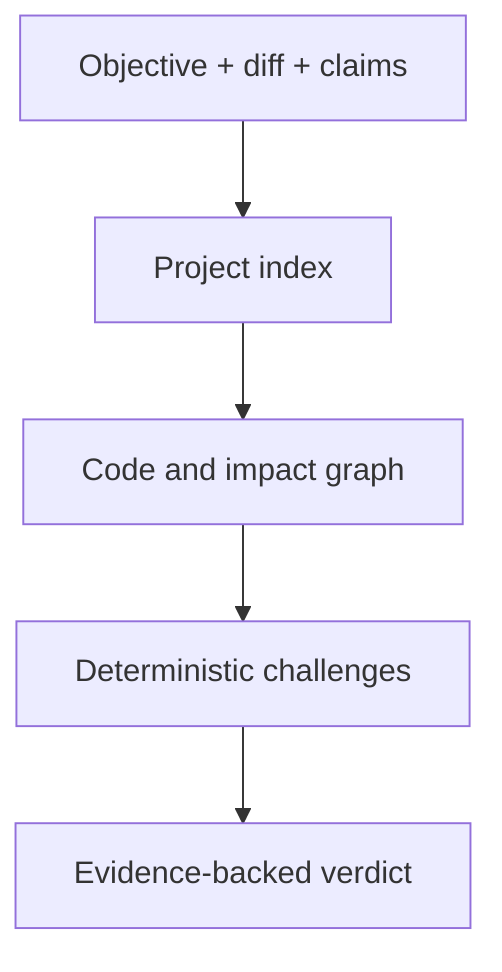

# Conclave

**AI writes. Conclave verifies.**

Conclave is a local-first, graph-aware validator for code changes. It does not need to be the agent that wrote the patch. It independently checks whether the resolution matches its objective, whether completion claims are true, and whether a small diff has consequences elsewhere in the project.

The primary product surface is `conclave review`. Ask, retrieval, graph inspection, MCP, and bounded Task execution remain available as supporting capabilities, but they are not the product promise.

## What a review does

1. Collects a working-tree, staged, branch, or commit change without executing repository code.
2. Builds the current project index and deterministic code graph.
3. Maps changed lines to symbols.
4. Expands impact through callers, references, imports, exports, containment, and contracts.
5. Checks an explicit validation contract and rejects contradicted completion claims.
6. Returns `PASS`, `WARN`, `BLOCK`, or `INCONCLUSIVE` with evidence and remediation.

A small diff is not assumed safe. If it changes an exported symbol whose callers live outside the diff, Conclave reports those unchanged consumers.

## Quick start

Requires Node.js 20 or newer.

```bash
npm install
npm run build

node dist/cli.js review . --working \
  --objective "Restore the session after page refresh"

node dist/cli.js review . --staged \
  --objective "Reject expired access tokens"

node dist/cli.js review . --branch origin/master \
  --contract examples/validation-contract.json

node dist/cli.js review . --commit HEAD \
  --objective "Rename persistToken without leaving stale callers" \
  --json
```

Review defaults to `--working` when no change source is supplied.

Exit codes:

| Verdict | Exit code | Meaning |
| --- | ---: | --- |
| `PASS` | 0 | Deterministic checks found no blocking or warning condition |
| `WARN` | 0 | Review is usable, but human attention is required |
| `BLOCK` | 1 | A deterministic contradiction, parser error, or scope violation exists |
| `INCONCLUSIVE` | 2 | Conclave cannot honestly prove the resolution with available evidence |

## Validation contracts

A contract turns the task description and the agent's completion claims into fetchable, comparable checks.

```json
{
  "objective": "Restore authentication after refresh without changing unrelated routes",
  "allowedPathPrefixes": ["src/auth", "tests/auth"],
  "claims": [
    {
      "id": "restore-exists",
      "statement": "bootstrapSession exists in the resulting project.",
      "check": {
        "kind": "symbol-exists",
        "symbol": "bootstrapSession",
        "expectation": "present"
      }
    },
    {
      "id": "legacy-removed",
      "statement": "The legacy token key no longer exists.",
      "check": {
        "kind": "text",
        "text": "legacy-auth-token",
        "expectation": "absent"
      }
    }
  ]
}
```

Supported deterministic claim checks are `symbol-exists`, `callers`, `references`, `text`, and `file-changed`.

## Architecture



Repository source is untrusted data. The review collector invokes Git with `shell: false`, disables prompts, bounds output and time, and never executes repository scripts. The first validation gate is fully deterministic and makes no model call.

## What came from the Gauntlet Loop idea

[Gauntlet Loop](https://github.com/robonuggets/gauntlet-loop) is a prompt skill, not a reusable validation engine. Conclave adopts its strongest principles without copying its implementation:

- use a concrete, fetchable quality bar;
- separate the builder from a harsh critic;
- inspect actual output instead of trusting a description;
- identify the largest remaining gap.

In Conclave, the quality bar becomes a validation contract plus repository invariants. The critic becomes an independent verifier. Unlike Gauntlet Loop, Conclave never loops indefinitely: work is bounded, and unresolved proof returns `INCONCLUSIVE`.

## Current deterministic findings

- no collected change;
- changed files outside explicit scope;
- parser diagnostics in changed source;
- graph impact outside the diff;
- exported symbol changes without changed tests;
- deleted-only behavior that requires a base index;
- contradicted or unprovable completion claims.

## Supporting tools

```bash
npm run dev -- index /path/to/repository
npm run dev -- retrieve /path/to/repository "Where is bootstrapSession called?"
npm run dev -- graph /path/to/repository bootstrapSession --operation callers
npm run dev -- ask /path/to/repository "Why might authentication disappear after refresh?"
npm run dev -- mcp /path/to/repository
```

Task Mode remains isolated and policy-controlled. It is not part of the validation trust boundary and cannot turn an Ask or Review request into permission to modify the repository.

## Validation

```bash
npm run eval:validation
npm run verify
```

The validation tests cover Git diff parsing, graph impact outside the diff, contradicted claims, and scope expansion. Existing retrieval, reasoning, Task, web, security, and release evaluations remain active.

## Current limits

- The deterministic parser currently targets TypeScript and JavaScript.
- The graph is syntax-aware and does not yet use the TypeScript type checker or `tsconfig` aliases.
- Deleted-only changes return `INCONCLUSIVE` because this branch indexes current HEAD, not both base and head.
- Review does not execute repository tests. Test execution remains a separately permissioned capability.
- Free-form semantic claims still require the bounded reasoning layer; the first review gate accepts structured deterministic claims.
- Real-world precision and false-positive rates still need dogfooding on external PRs.

See [the super-validator design](docs/super-validator.md), [security boundaries](docs/security.md), and [contributing guide](CONTRIBUTING.md).

Conclave is released under the [MIT License](LICENSE).
