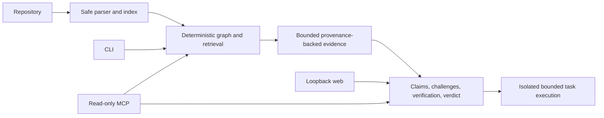

# Phase 6 — Release readiness and MCP

## Release architecture

MCP is stdio JSON-RPC and read-only. It is launched against one repository root with `conclave mcp /path/to/repository`; clients cannot choose another host path. It exposes compact search, symbol, graph, graph-path, evidence, Ask, and Investigate tools. Repository source is explicitly returned as untrusted evidence. Task Mode, shell execution, provider configuration, and environment access are absent.

## Provider and embedding status

OpenAI-compatible Chat Completions is supported for OpenAI, OpenRouter, OpenCode Zen, Ollama, LM Studio, and compatible services when a base URL/model/credential combination is configured. Native Anthropic and Gemini adapters are not advertised as working. `conclave provider-check` runs a bounded inference diagnostic and reports safe availability fields only.

Local Mode permits loopback HTTP(S) endpoints only. Retrieval is local; external calls are disabled only when the configured model and embedding services are also loopback. Learned embeddings are an explicit `CONCLAVE_EMBEDDING_MODE=openai-compatible` option with model, endpoint, and dimensions required. Their model/versioned provider ID invalidates incompatible indexes. The default remains deterministic `conclave-local-hash-v1` for CI and offline use.

Free Mode remains a deployable configuration boundary, not a hosted public service in this release. Remote Git import is deferred: local folder ingestion is the only public source because safe hosted cloning, quotas, and SSRF controls need their own deployment design.

## Release commands

`npm run demo` runs the deterministic end-to-end fixture. `npm run eval:release` runs a 12-case retrieval corpus covering auth, storage, lifecycle, subscriptions, graph paths, types, and deliberately ambiguous `restoreState` names. `npm run verify` runs tests, web tests, typecheck, lint, builds, original deterministic evaluations, this release corpus, and dependency audit. Real-provider evaluation is opt-in through existing configured CLI commands and is never part of CI.

## Known limits

The broader quality claims remain bounded by deterministic fixtures. No hosted Free endpoint, remote repository import, persistent web history, patch application, or MCP Task Mode is included. See `docs/security.md` for the active threat model.
